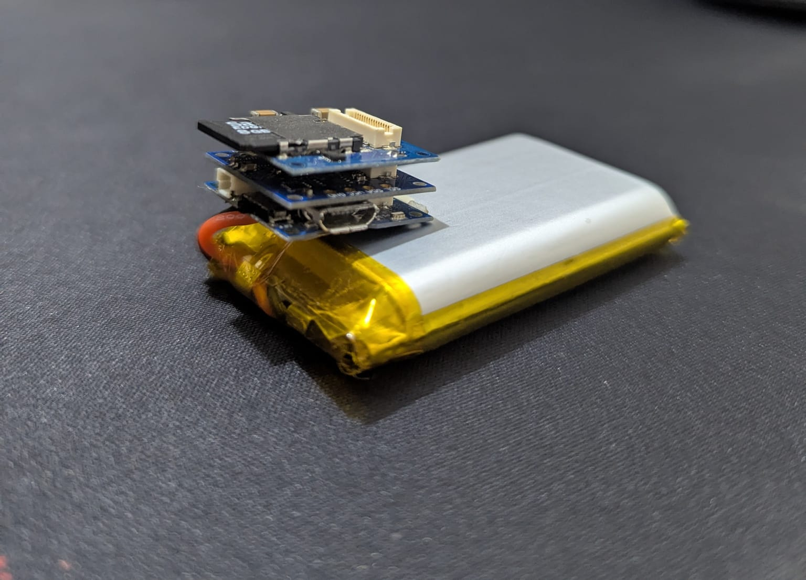

# Accelerometer and Data Logger for Small Animal Research

## Description  
This project focuses on developing a lightweight, low-power, and cost-effective data logging system for small animal research. It utilizes an **TinyZero microcontroller** and a **Tiny Accelerometer (BMA250)** to efficiently record motion data. The system is designed to minimize energy consumption through features such as periodic sleep modes and selective SD card writes, ensuring extended operation while maintaining a compact form factor.

## Features  
- Collects X, Y, and Z accelerometer data.  
- Low-power design with extensive use of sleep modes to extend battery life.  
- Timestamped data logging to an SD card in CSV format.  
- Configurable parameters for sampling rate, sleep intervals, and data save frequency.  
- Compact and lightweight design for small animal applications.  

## Hardware Requirements  
To replicate this project, the following components are required:  

### Components Needed:  
- **TinyZero board (1)**  
- **Accelerometer TinyShield (1)**  
- **MicroSD TinyShield (1)**  
- **UMC 8GB microSD card (1)**  
- **3.7V battery (1)**  

  
  
<em>Figure 1: Device Setup</em>

### Steps to Assemble:  
1. Connect the Accelerometer TinyShield to the TinyZero board.  
2. Attach the MicroSD TinyShield on top of the Accelerometer TinyShield.  
3. Insert the 8GB microSD card into the MicroSD TinyShield slot.  
4. Connect the 3.7V battery to the TinyZero’s battery port.  

## Installation and Setup  

1. Install the required Arduino libraries:  
   - **Wire.h**  
   - **BMA250**  
   - **RTCZero**  
   - **ArduinoLowPower**  
   - **SdFat**  
   - **Adafruit_SleepyDog**  

2. Flash the code to your microcontroller using the Arduino IDE.

3. Adjust configurable parameters in the code (`INITIAL_SLEEP_TIME`, `RECORD_INTERVAL`, etc.).

## Usage  
1. After setting up, deploy the device in the animal's environment.  
2. Recorded data will be stored on the SD card in `logfile.csv`. 

## Sample Data Output  

The recorded data is stored in a CSV file with the following format:  
**Timestamp Format:** `Day : Hour : Minute : Second.Milliseconds`

| TimeStamp          | X     | Y    | Z    | Temperature (°C) |
|--------------------|-------|------|------|------------------|
| 1 : 12 : 34 : 56.128 | -114  | 72   | 221  | 29.5             |
| 1 : 12 : 34 : 56.192 | -114  | 73   | 221  | 29.5             |
| 1 : 12 : 34 : 56.256 | -115  | 73   | 221  | 29.5             |

