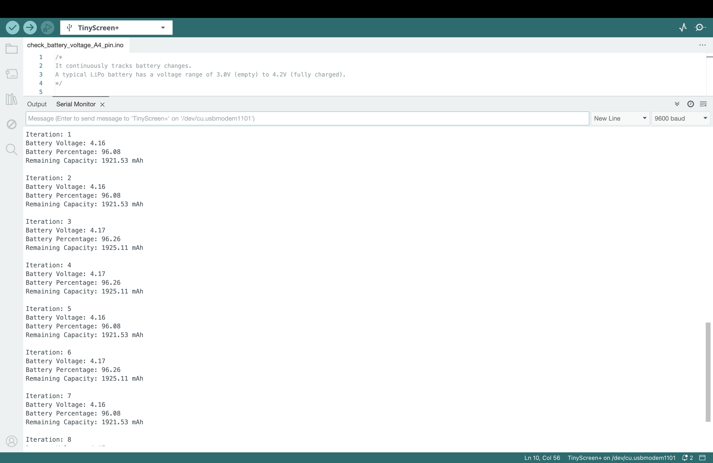
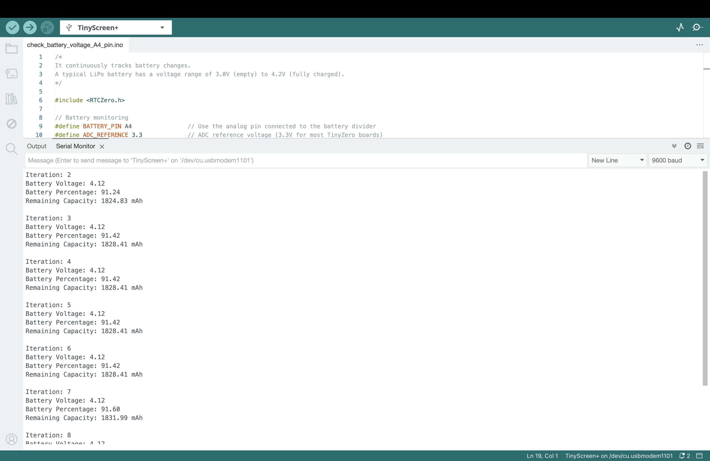
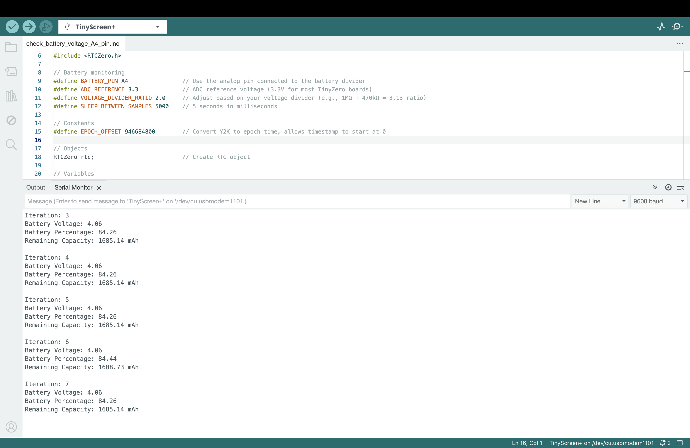

# Battery Drain Test  

This document shows the battery status at different time intervals during the test. The test was conducted while running a continuous file-writing process, where data was written to a file every **64 milliseconds**.  

## Initial State (0 Hours)  
- **Battery Voltage:** 4.16 V  
- **Battery Percentage:** 96.08%
- **Remaining Capacity: 1921.53 mAh**

  

## After 3 Hours  
- **Battery Voltage:** 4.12 V  
- **Battery Percentage:** 91.24%
- **Remaining Capacity: 1824.83 mAh**

  

## After 10 Hours  
- **Battery Voltage:** 4.06 V  
- **Battery Percentage:** 84.26%  
- **Remaining Capacity: 1685.14 mAh**

  

## Summary  
During the test, a **continuous file-writing process** was running, writing data every **64 milliseconds**. The images above show how the battery voltage and charge decreased over time under these conditions.    
